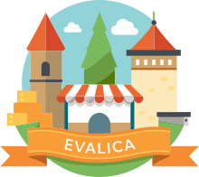

# Evalica

[![Tests][github_tests_badge]][github_tests_link] [![PyPI Version][pypi_badge]][pypi_link]

[github_tests_badge]: https://github.com/dustalov/evalica/actions/workflows/test.yml/badge.svg?branch=master
[github_tests_link]: https://github.com/dustalov/evalica/actions/workflows/test.yml
[pypi_badge]: https://badge.fury.io/py/evalica.svg
[pypi_link]: https://pypi.python.org/pypi/evalica

Evalica, your favourite evaluation toolkit.

- [Tutorial.ipynb](Tutorial.ipynb)
- [Working Example](https://dustalov.github.io/evalica/)
- [Pair2Rank](https://huggingface.co/spaces/dustalov/pair2rank)

